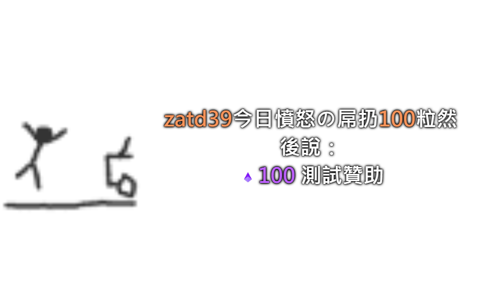
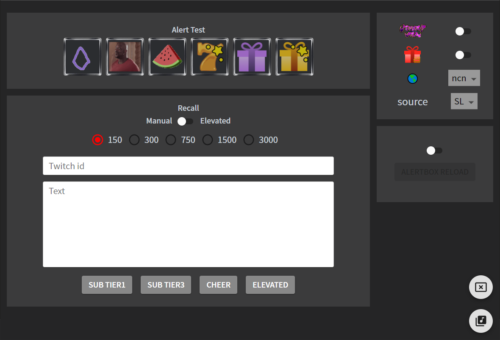
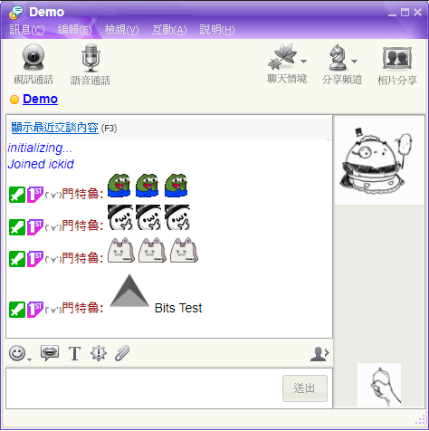
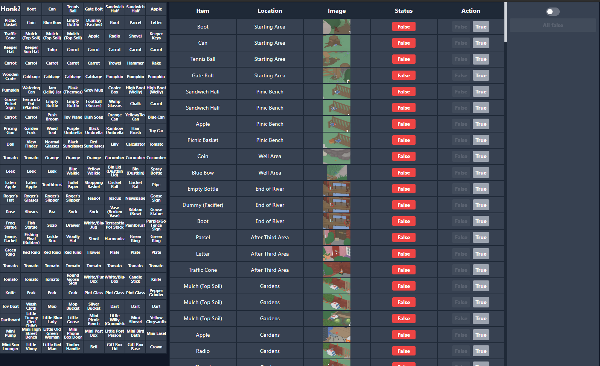
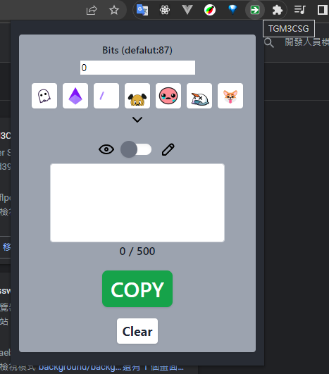

<h1 align="center">Projects</h1>

## [Copycat Alertbox](https://github.com/TechGuaMaster3/twitch-alertbox-tmi)

* 仿製 StreamLab Alert Box，搭配 Control Panel 作使用。
* 使用 React 製作。
* 串接 Twitch API 取得素材圖片資料。
* 串接自架 API 取得 Google TTS 語音生成及存於 MongoDB 的使用者設定。
* 使用 tmi.js 串接 twitch 聊天室取得 event 通知及 Control Panel 控制指令。
* 使用 socket.io 串接 Streamlabs 取得 event 通知。

---

## [Copycat Alertbox Control Panel](https://github.com/TechGuaMaster3/tgm3-control-panel)

[demo](https://techguamaster3.github.io/tgm3-control-panel/) 
(需加上 URL parameters id=twitch id 及 token=twitch token 才可使用)
* 搭配仿製 StreamLab Alert Box 作使用的 Control Panel。
* 使用 React Hooks 製作。
* 使用 MUI + tailwind 完成排版 RWD 。
* 串接自架 API 取得存於 MongoDB 的使用者設定/歷史 event。
* 使用 tmi.js 串接 twitch 聊天室發送控制指令。

---

## [YahooMessenger Twitch Chatroom](https://github.com/m3ntru/twitch-chatroom-yahoo-messenger)

[demo](https://m3ntru.github.io/twitch-chatroom-yahoo-messenger?id=zatd39&status=狀態文字&title=標題文字)
(需加上 URL parameters id=twitch id 才可運作)
* 仿製 YahooMessenger 風格聊天室實況 Layout。
* 使用 React Hooks 製作。
* 串接 Twitch, BTTV API 取得素材圖片資料。
* 使用 tmi.js 串接 twitch 聊天室取得聊天訊息及 event 通知。

---

## [Untitled Goose Game Item List Sheet Layout](https://github.com/m3ntru/untitled-goose-game-sheet)

[Web demo](https://m3ntru.github.io/untitled-goose-game-sheet/)

[Streaming demo](https://www.twitch.tv/videos/1607181999)

* 仿製 [此影片](https://www.youtube.com/watch?v=qEy_nyIf0s4) 所使用之實況 Layout。
* 使用 React Hooks 製作。
* 使用 tailwind 完成排版 RWD 。
* 使用 tmi.js 串接 twitch 聊天室發送控制指令。

---

## [TGM3CSG](https://github.com/TechGuaMaster3/cheer-string-generator)

[Web demo](https://techguamaster3.github.io/cheer-string-generator/)

[Chrome Extension demo](https://hackmd.io/@M3ntru/TGM3CSG)

* 快速產生 twitch bits 訊息之 Web/Chrome Extension。
* 使用 React Hooks 製作。
* 使用 tailwind 完成排版 RWD。
* 使用 Chrome extension MV3。